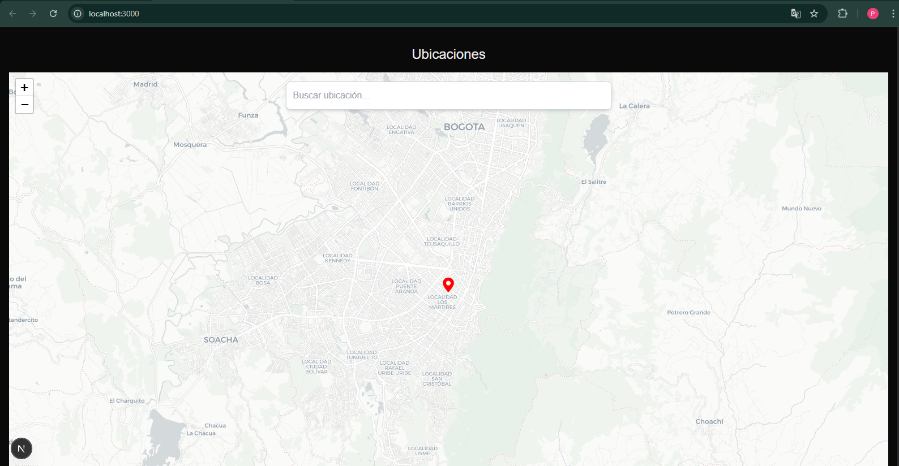

# Buscador de Ubicaciones con Mapa Interactivo



Aplicación web desarrollada como parte de una prueba técnica. Permite buscar ubicaciones y visualizarlas en un mapa interactivo utilizando Leaflet.js, con funcionalidades modernas como sugerencias, clic en el mapa y un buscador flotante.

---

## 🧠 Decisiones Técnicas

- **Leaflet.js + OpenStreetMap**: Se eligió Leaflet por ser open-source, ligero y sin necesidad de claves API. Se usó Carto como proveedor de tiles por su diseño claro.
- **Nominatim API**: Para geocodificación directa (buscar por texto) e inversa (clic en el mapa). No requiere autenticación.
- **Tailwind CSS**: Utilizado por su enfoque utilitario y facilidad para crear UI moderna sin necesidad de hojas de estilo complejas.
- **`lodash.debounce`**: Implementado para reducir el número de llamadas a la API de Nominatim mientras el usuario escribe.
- **Carga dinámica del mapa (`ssr: false`)**: Porque Leaflet depende de `window` y no es compatible con SSR en Next.js.

---

## 📦 Dependencias Principales

- `react`
- `next`
- `leaflet`
- `lodash.debounce`
- `axios`
- `tailwindcss`

---

## ⚙️ Instalación y Ejecución

### 1. Clonar el repositorio

```bash
git clone https://github.com/tu-usuario/buscador-mapas.git
cd buscador-mapas

2. Instalar dependencias
npm install
3. Ejecutar servidor de desarrollo
npm run dev

El proyecto estará disponible en http://localhost:3000

🔑 Configuración de API
API utilizada: Nominatim

No requiere autenticación ni claves.

Se recomienda limitar solicitudes a 1 por segundo. Se aplica debounce de 300ms para cumplir esta recomendación.

🎯 Funcionalidades
Mapa interactivo con marcador rojo personalizado.

Búsqueda de ubicaciones con autocompletado.

Clic sobre el mapa para seleccionar una nueva ubicación.

El buscador es flotante, visible en todo momento.

Responsive y diseño claro.


🚧 Limitaciones y Áreas de Mejora
No se eliminan marcadores anteriores tras múltiples clics.

No hay validación de errores si la API falla.

No hay navegación con teclado en las sugerencias.

No hay despliegue en producción (puede usarse Vercel).

📁 Estructura del Proyecto
bash
Copiar
Editar
/components
  └── Map.tsx             # Componente del mapa y buscador
/pages
  └── index.tsx           # Página principal
/public
  └── mapa.png            # Imagen de vista previa usada en el README
/styles
  └── globals.css         # Estilos base de Tailwind

  👤 Autor
Brikman Paul

GitHub